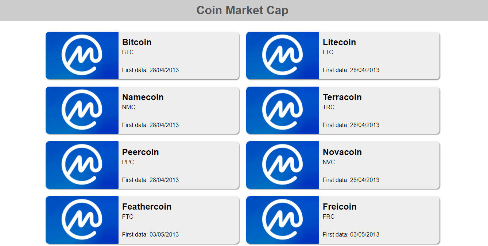

# API Coin Market Cap (projeto DIO)

Projeto didático desenvolvido durante curso da DIO (Digital Innovation One).

O projeto consiste em uma requisição de API de criptomoeda com JavaScript, exibindo alguns resultados em uma página web responsiva.

## Para executar o projeto ::computer:

- clone este repositório 

  ```
  git clone https://github.com/davi-santos5/dio-api-coinmarketcap.git
  ```

- obtenha uma chave de acesso/token no site [Coin Market Cap](https://pro.coinmarketcap.com/account) para consultar a API

- insira a chave no arquivo `script.js` 

  ```
  const apiKey = {key: 'Insira sua chave aqui'}
  ```

- abra o arquivo `index.html` no Google Chrome

- instale e ative extensão [Moesif Origin & CORS Changer](https://chrome.google.com/webstore/detail/moesif-origin-cors-change/digfbfaphojjndkpccljibejjbppifbc?hl=pt-BR) para visualizar o resultado





Projeto feito com HTML5, CSS3 e JavaScript.